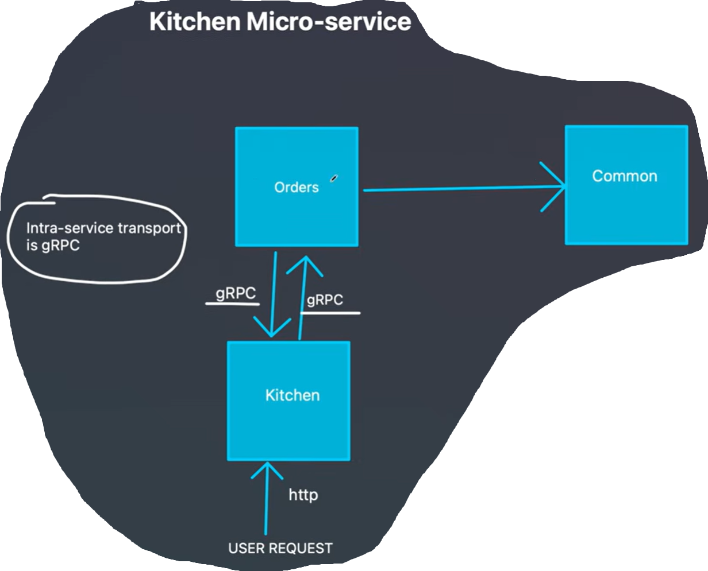
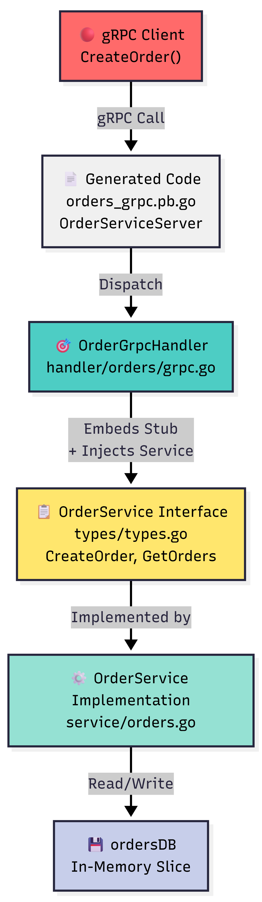

* [```gRPC docs```](https://grpc.io/docs/languages/go/quickstart/)
    - installing protobuf

* [Tutorial Video](https://www.youtube.com/watch?v=ea_4Ug5WWYE)

<div align="center">
  
</div>

### Why gRPC?

* More performant;

* Sending JSON by HTTP is expensive because of data marshalling and unmarshalling;

* gRPC uses Protocol Buffers as it’s default serialization mechanism which is a binary serialization;

* Real good candidate for transport between server to server communications;


## Makefile Commands

### [`make gen`](Makefile)
**Essential first step in gRPC development.** Compiles protocol buffer definitions ([`orders.proto`](protobuf/orders.proto)) into Go code and gRPC service stubs. This generated code is required before you can implement or call gRPC services—it defines the message types and service interfaces that all microservices will use for communication.

---

## 📝 Understanding Protocol Buffer Message Fields

### Field Numbers (1, 2, 3, 4...)
In protobuf messages, each field has a unique **number** that identifies it during binary serialization:

```protobuf
message CreateOrderRequest {
    int32 customerID = 1;    // Field number 1
    int32 productID = 2;     // Field number 2
    int32 quantity = 3;      // Field number 3
}
```

**Why they matter:**
- **Binary Encoding:** Field numbers (not names) are encoded in the binary format, reducing data size
- **Backward Compatibility:** Old clients can still read data from new servers, and vice versa—as long as field numbers stay the same
- **Efficiency:** Fields 1-15 use 1 byte (most efficient), 16-2047 use 2 bytes. Use low numbers for frequently used fields.
- **Safety:** Once a field is used in production, never reuse its number—reserve it instead:
  ```protobuf
  message Order {
      reserved 1;           // Old field, don't reuse this number
      int32 OrderID = 2;
  }
  ```

---

## 🔧 Understanding gRPC Stubs & Proto Flow

### 📋 What is a Stub?
A **stub** is auto-generated placeholder code that implements all service methods with default behavior (typically returning "method not implemented" errors). It allows your code to compile even when you haven't implemented every method yet.

### 🔄 gRPC Development Flow

```
1. Define Service in Proto
   └─→ services/orders/proto/orders.proto
       rpc CreateOrder(OrderRequest) returns (OrderResponse);
       rpc GetOrder(GetOrderRequest) returns (OrderResponse);

2. Run `make gen` (protoc compiler)
   └─→ Generates: UnimplementedOrderServiceServer (all stubs)
       └─→ CreateOrder() → "method not implemented" ❌
       └─→ GetOrder() → "method not implemented" ❌

3. Embed Stub in Your Handler
   └─→ OrderGrpcHandler embeds UnimplementedOrderServiceServer
       (inherits all stub implementations)

4. Implement Methods One by One
   └─→ func (h *OrderGrpcHandler) CreateOrder(...) { ... } ✅
       └─→ Overrides the stub, client gets real implementation
       └─→ GetOrder() still uses stub, returns "not implemented" ❌

5. As you implement more methods
   └─→ More methods work ✅
       └─→ Unimplemented ones fail with clear error message
```

### ⚡ Why Stubs Matter

| Scenario | **Without Stubs** ❌ | **With Stubs** ✅ |
|----------|---|---|
| **Implement 1 of 3 methods** | ❌ Compilation Error: Missing implementations | ✅ Compiles fine, unimplemented methods return clear error |
| **Someone calls unimplemented method** | ❌ Missing method error (confusing) | ✅ Clear: "rpc error: method not implemented" |
| **New proto method added** | ❌ All existing code breaks | ✅ Code still works, new method fails gracefully |
| **Team work** | ❌ Must implement everything before merging | ✅ Each person can implement their methods independently |
| **Development speed** | ❌ Slower (blocked on full implementation) | ✅ Faster (implement incrementally) |

### 💡 Example

```go
// Your handler embeds the stub
type OrderGrpcHandler struct {
    orderService types.OrderService
    orders.UnimplementedOrderServiceServer  // ← Gets all stubs here
}

// You implement CreateOrder
func (h *OrderGrpcHandler) CreateOrder(ctx context.Context, req *OrderRequest) (*OrderResponse, error) {
    return h.orderService.Create(req), nil  // ✅ Real implementation
}

// GetOrder not implemented yet? No problem!
// Client calling GetOrder gets: "rpc error: code = Unimplemented desc = method GetOrder not implemented"
// This is a clear signal: "implement this method next"
```

---

## 📐 Orders Service Architecture

<div align="center">
  
</div>

### Key Design Principles

| Layer | Purpose | File |
|-------|---------|------|
| **Client** | Makes gRPC calls | External |
| **Generated Code** | Handles gRPC protocol & serialization | `orders_grpc.pb.go` (auto-generated) |
| **Handler** | Implements gRPC interface, validates, delegates | `handler/orders/grpc.go` |
| **Interface** | Defines service contract (transport-agnostic) | `types/types.go` |
| **Implementation** | Business logic, data operations | `service/orders.go` |
| **Storage** | Persists data | In-memory slice |

### Why Each Layer?

- **Separation of Concerns**: gRPC (transport) is separate from business logic (service)
- **Testability**: Service layer can be tested without gRPC; handler can be mocked
- **Reusability**: Same service can be used by REST API, Kafka consumer, CLI, etc.
- **Flexibility**: Easy to swap implementations or add new features

---

## 🔌 Client-Side Architecture: Connection vs Service

### Two-Level Client Architecture

When calling gRPC services, you need **two levels**:

```go
// ✅ Level 1: Connection (Transport Layer)
conn := NewGRPCClient(":9000")
// Creates TCP connection to the gRPC server
// Think: "where am I connecting to?"

// ✅ Level 2: Service Client (Application Layer)
orderClient := orders.NewOrderServiceClient(conn)
// Specifies which service to use on that connection
// Think: "which service do I want?"

// Now make calls
orderClient.CreateOrder(ctx, request)
```

### Why Two Levels?

A **single gRPC server can host MULTIPLE services on the SAME port**. The connection identifies the server, the service client identifies which handler/service you want.

### Visual Comparison: HTTP vs gRPC

#### HTTP (One Service Per Port)
```
Client Browser          Server
         │                │
    HTTP Request    ──────→ Port 8000 → Order API
         │                │
    HTTP Request    ──────→ Port 8001 → Payment API
         │                │
    HTTP Request    ──────→ Port 8002 → Notification API
```

#### gRPC (Multiple Services on One Port)
```
Client App                    Server
         │                      │
    gRPC Call (Order)    ──────→ Port 9000 ─┬─ OrderService
         │                      │           │
    gRPC Call (Payment)  ──────→ Port 9000 ─┼─ PaymentService
         │                      │           │
    gRPC Call (Notify)   ──────→ Port 9000 ─┴─ NotificationService
         │                      │
         └─────(Single TCP Connection, Multiplexed)─────┘
```

### Example: Multiple Services on One Port

#### Server-Side (Registering Multiple Services)

```go
// grpc.go - Orders service with multiple handlers
func (s *gRPCServer) Run() error {
    lis, _ := net.Listen("tcp", ":9000")
    grpcServer := grpc.NewServer()

    // Register MULTIPLE services on the SAME port
    orderService := service.NewOrderService()
    handler.NewGrpcOrdersService(grpcServer, orderService)  // ← OrderService

    paymentService := service.NewPaymentService()
    handler.NewGrpcPaymentService(grpcServer, paymentService)  // ← PaymentService

    notificationService := service.NewNotificationService()
    handler.NewGrpcNotificationService(grpcServer, notificationService)  // ← NotificationService

    log.Println("Starting gRPC server on :9000 with 3 services")
    return grpcServer.Serve(lis)
}
```

#### Client-Side (Kitchen Service Calling All Three)

```go
// http.go - Kitchen service as gRPC client
func (s *httpServer) Run() error {
    router := http.NewServeMux()

    // ✅ Step 1: Single connection to :9000
    conn := NewGRPCClient(":9000")
    defer conn.Close()

    router.HandleFunc("/orders", func(w http.ResponseWriter, r *http.Request) {
        // ✅ Step 2a: Create OrderService client
        orderClient := orders.NewOrderServiceClient(conn)
        order, _ := orderClient.CreateOrder(ctx, &orders.CreateOrderRequest{...})
    })

    router.HandleFunc("/payments", func(w http.ResponseWriter, r *http.Request) {
        // ✅ Step 2b: Create PaymentService client (SAME connection!)
        paymentClient := payment.NewPaymentServiceClient(conn)
        payment, _ := paymentClient.ProcessPayment(ctx, &payment.PaymentRequest{...})
    })

    router.HandleFunc("/notifications", func(w http.ResponseWriter, r *http.Request) {
        // ✅ Step 2c: Create NotificationService client (SAME connection!)
        notifyClient := notification.NewNotificationServiceClient(conn)
        notify, _ := notifyClient.SendEmail(ctx, &notification.EmailRequest{...})
    })

    return http.ListenAndServe(s.addr, router)
}
```

### Key Insight

```go
// One connection serves all services
conn := NewGRPCClient(":9000")

// But you need different clients for different services
orderClient := orders.NewOrderServiceClient(conn)
paymentClient := payment.NewPaymentServiceClient(conn)
notifyClient := notification.NewNotificationServiceClient(conn)

// Each client knows which service to call
orderClient.CreateOrder(...)      // Calls OrderService
paymentClient.ProcessPayment(...) // Calls PaymentService
notifyClient.SendEmail(...)       // Calls NotificationService
```

### Benefits of This Design

| Benefit | Explanation |
|---------|-------------|
| **Single Connection** | One TCP connection multiplexes multiple services → efficient |
| **Service Separation** | Each service has its own handler, logic, and proto definition |
| **Scalability** | Add new services without opening new ports |
| **Clean Architecture** | Service-to-service communication is organized and type-safe |
| **Performance** | HTTP would need 3 connections, gRPC uses 1 multiplexed connection |